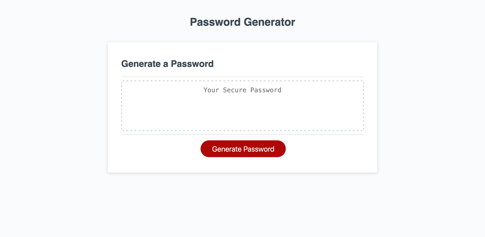

# Password Generator

## Description

This project is a webpage featuring a JavaScript-powered password generator. The goal of the project is to provide an easy way for people to create secure, random passwords to use. In this case, the user inputs how long they want their password to be, as well as what types of characters they want in it, and a password is randomly generated for them meeting those criteria.

In completing this project, I was reminded of the difficulty of handling user input, as well as the importance of reading the documentation (in this case, of JavaScript's built-in functions). Handling user input is difficult because you have to consider all the different possible inputs if you want to be sure none of them will break your code, which I experienced while implementing the user prompts. Implementing the prompts was also where I ran into trouble with the documentation. I assumed that prompt() would return a number value when the user input was only numbers, instead of the string value that it does return. This caused my some frustration which could have been preempted if I had double-checked the documentation in the beginning.

## Installation

N/A

## Usage

To view the page, navigate to https://spencersurface.github.io/password-generator in your web browser.

To generate a password, click on the red "Generate Password" button on the page. Your web browser will prompt you to pick a password length, and confirm with you whether you want your password to include each of four character types. Once you have made your selections, the password will generate and appear in the textbox on the page titled "Generate a Password", from which you can copy and use it.

Here is a screenshot demonstrating how the page should appear: 

## Credits

This project consists primarily of code refactored from files provided by edX Boot Camps LLC. edX was the source of the index.html and style.css files which I did not change, as well as the source of the initial script.js file. In the script.js file, my contributions were the constants at the top of the file, as well as the definition of the generatePassword() function. This README file was created by myself, as was the screenshot of the deployed app.

## License

No license at this time.